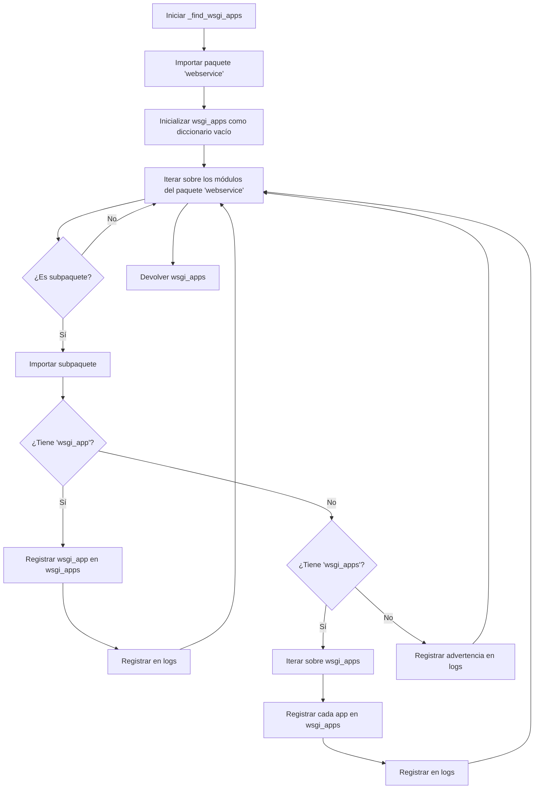

# La herramienta `webservice`

# Introducción

Este proyecto contiene una herramienta de línea de comandos (`webservice`) que está disponible mediante la orden `uv webservice`. Esta herramienta es un servidor WSGI, pero con una característica especial: analiza todos los submódulos que se encuentran en el módulo `webservice` y verifica si ese módulo tiene un objeto llamado `wsgi_app`. Si la encuentra, integrará esa aplicación en el servidor WSGI usando el nombre del módulo como ruta para acceder a esa aplicación desde la web.

Por ejemplo, si tu módulo asignado es `ffernandez` y contiene un objeto llamado `wsgi_app`, entonces `webservice` expondrá esa aplicación en la ruta `/ws/ffernandes`. Si el servidor se arranca en el puerto `8080`, entonces tu servicio web estará disponible desde `http://127.0.0.1:8080/ws/ffernandez`, además la descripción WSDL del servicio estará dispoible desde `http://127.0.0.1:8080/ws/ffernandez?wsdl`.

Finalmente, si el módulo `ffernandez` no  contiene un objeto llamado `wsgi_app`, simplemente registrará mensaje de advertencia en la bitácora y continuará con el siguiente módulo.

## Diagrama de funcionamiento




## Ejemplo de uso

Usarás el comando `uv webservice` para arrancar el servidor web de desarrollo y
hacer las pruebas con tu servicio web.

```
uv run webservice --debug
```

Cuando hagas cambios en tu código, el servidor reiniciará automáticamente.
Recuerda revisar los errores y advertencias en la terminal donde estas
ejecutando el servidor. Presiona `Ctrl`+`C` para terminar la ejecución del
servidor de pruebas.


## Referencia de la herramienta de línea de comandos `webservice`

::: mkdocs-click
    :module: webservice.app
    :command: main

