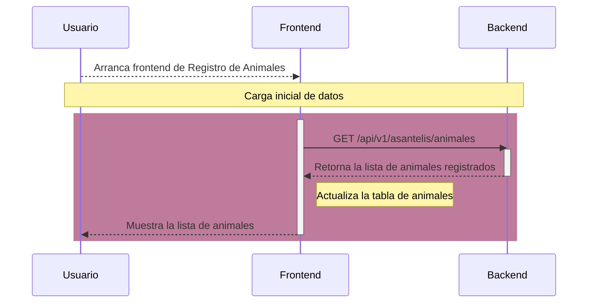
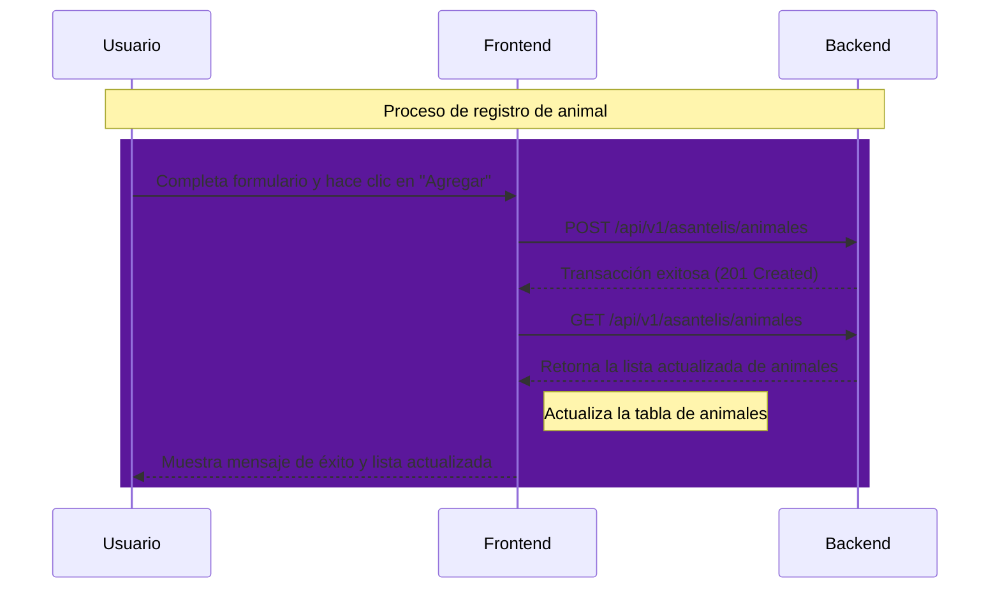
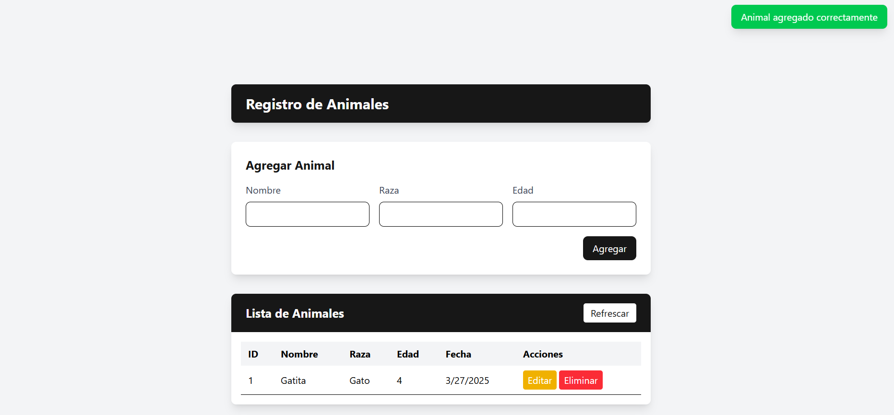
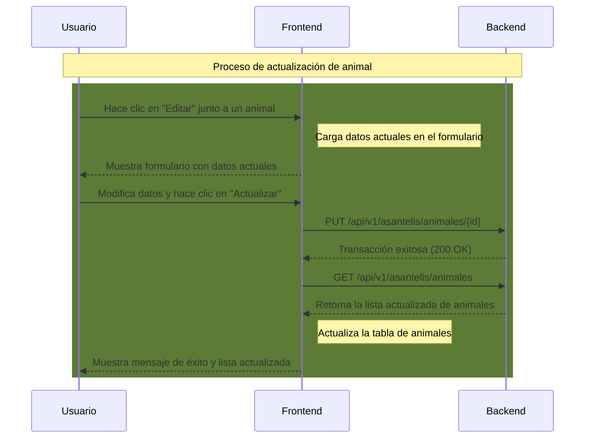
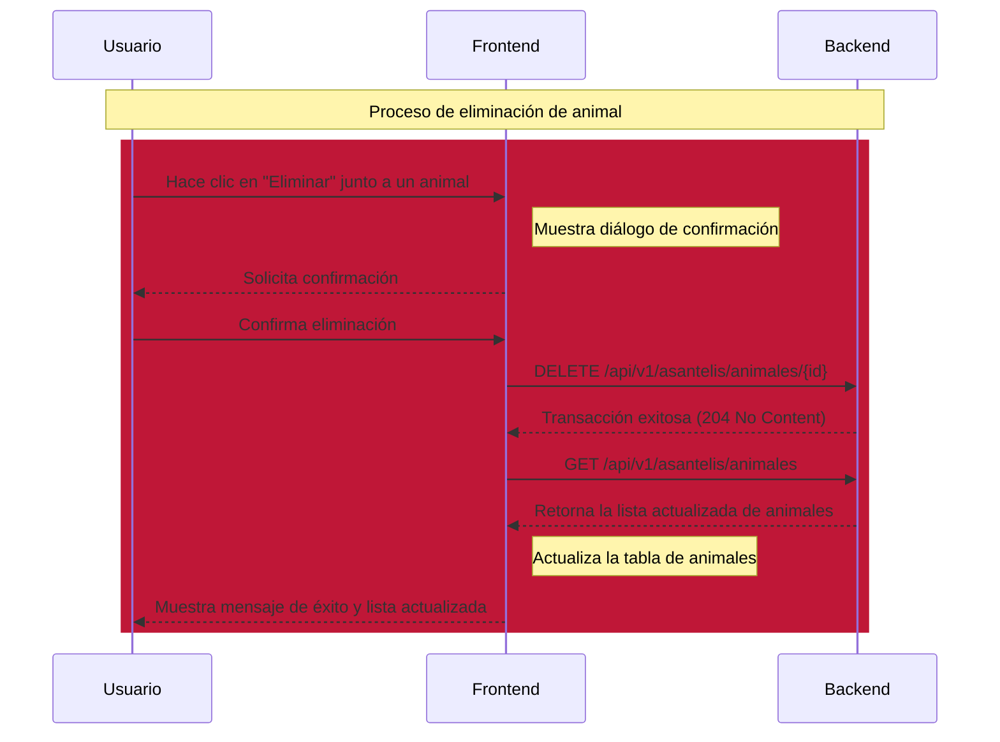

# 🐾 Proyecto Registro de Animales

{ width="30%" align=left }

!!! tip "✨ Descripción General"
    El proyecto **Registro de Animales** es un ejemplo práctico de cómo crear un API REST utilizando Python y FastAPI. Incluye un backend, un frontend y pruebas automatizadas para gestionar un registro de animales.

---

## 📋 Descripción general del funcionamiento del backend y el frontend

El backend está construido con [FastAPI](https://fastapi.tiangolo.com/). Los archivos de implementación se encuentran en la ruta `/app/proyectos/asantelis`. Ahí se definen cinco operaciones principales:

- 📜 Obtener lista de animales registrados
- ➕ Registrar un nuevo animal
- 🔍 Obtener detalles de un animal específico
- ✏️ Actualizar información de un animal
- 🗑️ Eliminar un registro de animal

El frontend está construido con [React](https://reactjs.org/) y [Astro](https://astro.build/), proporcionando una interfaz web moderna y atractiva. Se conecta al backend mediante la url `http://127.0.0.1:8000/api/v1/asantelis/animales`.

### 🔄 Carga inicial de datos

Cuando el usuario arranca el programa de frontend, este se conecta al backend para obtener la lista de animales registrados.

A continuación se muestra un diagrama de secuencia que muestra la comunicación inicial entre el frontend y el backend, justo después de que el usuario accedió al frontend.



### ➕ Registro de un nuevo animal

Una vez que el usuario ha arrancado el frontend y los datos iniciales han sido cargados, el usuario puede registrar un nuevo animal mediante el formulario de registro. Cuando el usuario completa el formulario y hace clic en el botón "Agregar", el frontend realiza una petición al backend para registrar el nuevo animal.


El formulario tiene validaciones básicas para no permitir campos vacíos, edades negativas, etc. Además del mensaje de error, el botón "Agregar" no se habilitará hasta que el usuario haya completado correctamente todos los campos requeridos.

Si el usuario introdujo datos válidos y presiona el botón "Agregar", el frontend hará la operación de registro con el backend. Si la transacción se acepta, volverá a contactar al backend para descargar la lista actualizada de animales y actualizar la interfaz con la nueva información. Ver el siguiente diagrama de secuencia.



Finalmente, la aplicación de frontend luce así después de varios registros.



### ✏️ Actualización de información de un animal

Otra operación importante es la actualización de la información de un animal registrado. El usuario puede hacer clic en el botón "Editar" junto al animal que desea modificar, lo que cargará los datos actuales en el formulario. Después de realizar los cambios necesarios, el usuario puede hacer clic en "Actualizar" para guardar los cambios.



### 🗑️ Eliminación de un animal

La última operación principal es la eliminación de un registro de animal. El usuario puede hacer clic en el botón "Eliminar" junto al animal que desea eliminar, lo que mostrará un diálogo de confirmación. Si el usuario confirma la eliminación, el frontend realizará una petición al backend para eliminar el registro.



---

## 🖥️ Backend - Detalle

El código fuente del backend se encuentra en el módulo `app/proyectos/asantelis`. Está desarrollado utilizando FastAPI y expone cinco rutas:

- **`GET /animales`**: Obtiene la lista de todos los animales registrados. [Link a la función](backend.md#app.proyectos.asantelis.routes.animals_list)
- **`POST /animales`**: Registra un nuevo animal. [Link a la función](backend.md#app.proyectos.asantelis.routes.create_animal)
- **`GET /animales/{animal_id}`**: Obtiene los detalles de un animal específico. [Link a la función](backend.md#app.proyectos.asantelis.routes.get_animal)
- **`PUT /animales/{animal_id}`**: Actualiza la información de un animal específico. [Link a la función](backend.md#app.proyectos.asantelis.routes.update_animal)
- **`DELETE /animales/{animal_id}`**: Elimina el registro de un animal específico. [Link a la función](backend.md#app.proyectos.asantelis.routes.delete_animal)

A continuación se muestran los links a la documentación de cada submódulo.

[Documentación de rutas](autodocs.md#routes){ .md-button .md-button--primary}
[Documentación de modelos](autodocs.md#models){ .md-button .md-button--primary}
[Documentación de esquemas](autodocs.md#schemas){ .md-button .md-button--primary}


### 🚀 Cómo arrancar el backend

Para iniciar el backend, utiliza el siguiente comando:

```bash
uv run fastapi run
```

---

## 🧪 Pruebas del Backend

Las pruebas automatizadas del backend se encuentran en el archivo `/tests/test_asantelis.py`. Estas pruebas verifican el correcto funcionamiento de las rutas y la lógica de negocio, incluyendo:

- 🗃️ Comportamiento de la API cuando la base de datos está vacía
- 🐾 Creación de registros de animales
- ✏️ Actualización de registros de animales
- 🗑️ Eliminación de registros de animales
- 🔍 Validación de datos de entrada para registros de animales

[Documentación de funciones de prueba](tests.md){ .md-button .md-button--primary}

### 🧪 Cómo ejecutar las pruebas
Para ejecutar las pruebas, utiliza el siguiente comando:

```bash
uv run pytest
```

---

## 🎨 Frontend

El código fuente del frontend se encuentra en el directorio `/frontend/asantelis/app/`. Este frontend interactúa con el backend para mostrar la lista de animales registrados y permitir operaciones como registro, actualización y eliminación.

[Documentación de Funciones del frontend](frontend.md){ .md-button .md-button--primary}


### 🚀 Cómo arrancar el frontend

Para iniciar el frontend, primero asegúrate de que el backend esté en ejecución, luego abre otra terminal, navega al directorio del frontend y utiliza los siguientes comandos:

```bash
cd frontend/asantelis/app
npm install
npm run dev
```

Después, abre tu navegador en la dirección que se muestra en la terminal (generalmente http://localhost:4321).
