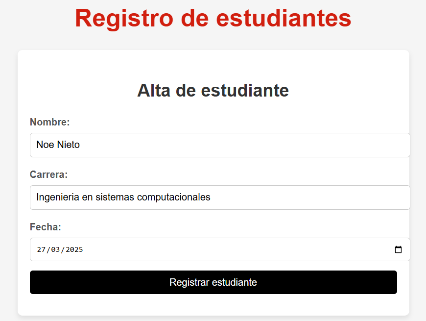
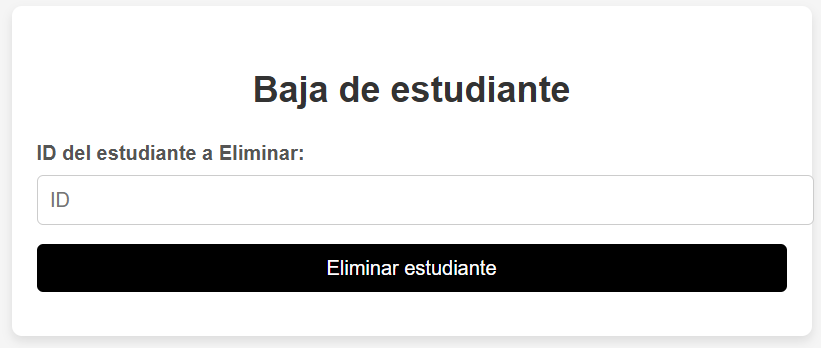
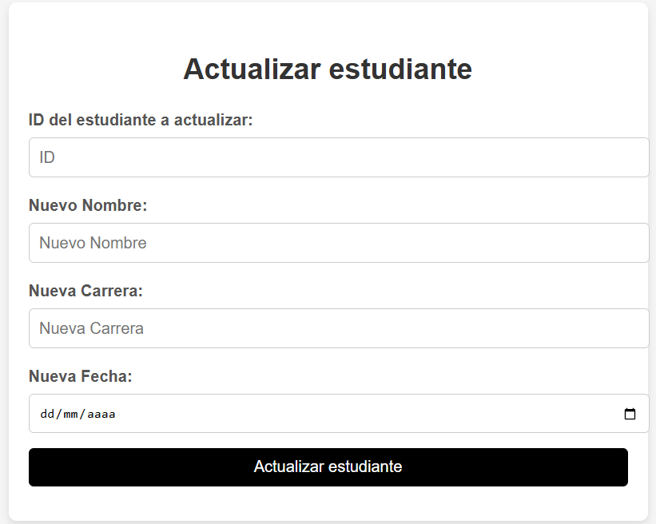
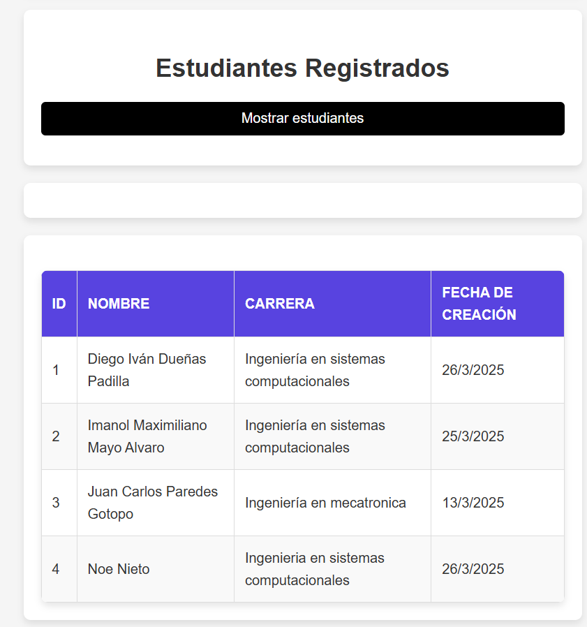

# Gestión de Estudiantes

## Descripción General

El proyecto "Gestión de Estudiantes" es una aplicación diseñada para administrar información de estudiantes. Consta de un backend desarrollado en `/proyectos/dduenas` y un frontend ubicado en `/frontend/dduenas`. El backend proporciona una API RESTful que gestiona las operaciones de datos, mientras que el frontend ofrece una interfaz gráfica para interactuar con el sistema.

El frontend y el backend interactúan mediante solicitudes HTTP. El frontend envía peticiones al backend para realizar operaciones como crear, leer, actualizar y eliminar información de estudiantes. El backend responde con los datos solicitados o confirma las operaciones realizadas.

---

## Backend

### Detalle del Backend

El backend está desarrollado utilizando [tecnología o framework utilizado, por ejemplo, Node.js con Express]. Proporciona una API RESTful con endpoints para gestionar estudiantes, incluyendo funcionalidades como:

- Crear un nuevo estudiante.
- Consultar la lista de estudiantes.
- Actualizar información de un estudiante.
- Eliminar un estudiante.

### Cómo arrancar el Backend

1. Navega al directorio del backend:
   ```bash
   cd /proyectos/dduenas
   ```
2. Instala las dependencias:
   ```bash
   npm install
   ```
3. Inicia el servidor:
   ```bash
   npm start
   ```
4. El backend estará disponible en `http://localhost:3000` (o el puerto configurado).

### Pruebas del Backend

El backend incluye pruebas automatizadas para garantizar el correcto funcionamiento de los endpoints.

### Cómo ejecutar las pruebas

1. Asegúrate de estar en el directorio del backend:
   ```bash
   cd /proyectos/dduenas
   ```
2. Ejecuta las pruebas:
   ```bash
   npm test
   ```

---

## Frontend

### Detalle del Frontend

El frontend está desarrollado utilizando [tecnología o framework utilizado, por ejemplo, React]. Proporciona una interfaz gráfica para que los usuarios puedan interactuar con el sistema de gestión de estudiantes. Incluye funcionalidades como:

- Formulario para agregar nuevos estudiantes.



- Formulario para eliminar estudiantes.



- Formulario para modificar estudiantes registrados.




- Tabla para visualizar la lista de estudiantes.



- Opciones para editar y eliminar estudiantes.

### Cómo arrancar el Frontend

1. Navega al directorio del frontend:
   ```bash
   cd /frontend/dduenas
   ```
2. Instala las dependencias:
   ```bash
   npm install
   ```
3. Inicia el servidor de desarrollo:
   ```bash
   npm start
   ```
4. El frontend estará disponible en `http://localhost:5090/inicio` (o el puerto configurado).

# Documentación automatica

[Documentación de rutas](rotes.md#routes){ .md-button .md-button--primary}
[Documentación de modelos](models.md#models){ .md-button .md-button--primary}
[Documentación de esquemas](schemas.md#schemas){ .md-button .md-button--primary}