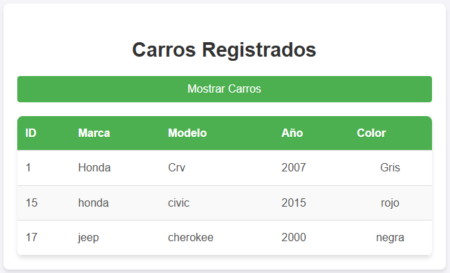

## Proyecto registro de carros.
{ width="30%" align=left }
# API Registro de Carros

La API Registro de Carros es una API desarrollada en Python utilizando la tecnología FastAPI. Su objetivo es gestionar un inventario de carros sin necesidad de utilizar una base de datos externa, ya que la API cuenta con su propio almacenamiento interno donde se registran los carros agregados por los usuarios.

# Archivo que conforman la API

La API está organizada en tres archivos principales: models.py, schemas.py y routes.py. Cada uno de estos archivos tiene una función específica:

routes.py: Maneja la lógica principal de la API, definiendo las rutas y los métodos HTTP que se ejecutan al recibir una solicitud.

models.py: Define las tablas internas utilizadas para almacenar los carros, especificando los campos, tipos de datos (texto, numérico, etc.) y si estos permiten valores nulos o no.

schemas.py: Contiene las clases que definen la estructura de los JSON que la API espera recibir y enviar. Esto asegura que los datos intercambiados cumplan con un formato específico.

# Registro de un carro

cuando un usuario quiere registrar un carro, solo debe llenar los campo con los datos solicitados, que serian Marca, Modelo, Año y Color, despues de insertar los datos se preciona el boton de Registrar carro y listo.

{width="60%"}

# Mostrar lista de carros

Si un usuario quiere revisar la lista de carros que tiene registrados, solo debe ir a la seccion de Carros registrados y dar clik en el boton.

{width="60%"}

# Eliminar carros

Si un usuario por alguna razon quiere eliminar uno de los carros existentes de la lista solo se necesita el ID correspondiente al carro que se quiere eliminar, dicho ID se obtiene en la listra de carros registrados, al poner el id en el campo y dar clik al bopton se elimina de la base de datos.

{width="60%" }

# Eliminar carros

Si un usuario desea solo modificar algun dato de un carro registrado tiene que llenar los campós con con la nueva informacion del carro pero empezando con la ID del carro.

{ width="60%"}

# Routes

::: app.proyectos.fcalzada.routes

---

# Schemas

::: app.proyectos.fcalzada.schemas

---

# Models

::: app.proyectos.fcalzada.models
