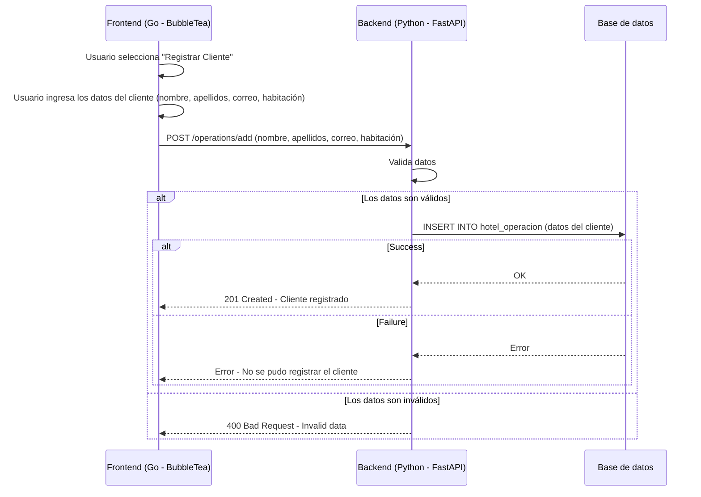
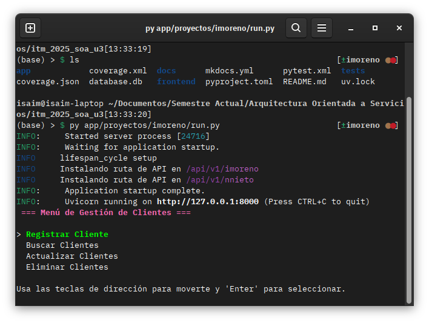

# Proyecto de registro de clientes de un hotel

!!! Tip "Descripción General"
    El proyecto usa API REST con Python usando FastAPI y el framework BubbleTea de Go para el frontend

## Descripción general del funcionamiento del frontend y backend

El frontend está hecho con el framework <a href="https://github.com/charmbracelet/bubbletea" target="_blank">BubbleTea</a>. El menú se navega con las flechas de dirección **↑ ↓**. Se selecciona con **Enter ↵**. Para salir se presiona la tecla **Esc**. Cuando se entra a uno de los formularios se cambia de campo con la tecla **Tab** y se regresa con la tecla **Esc**. 

Hay cuatro operaciones que se pueden hacer:

### Registrar cliente
Aquí se ingresa un nuevo cliente con la siguiente información:

- Nombre
- Primer apellido
- Segundo apellido
- Correo Electrónico
- Habitación asignada

### Buscar Clientes
Aquí se busca a un cliente existente con su nombre y apellidos como parámetros. Por lo menos un parámetro debe tener información. Cuando se encuentra al cliente se muestra la información guardada de éste.

### Actualizar Clientes
Aquí se puede cambiar el correo electrónico o la habitación asignada. Para elegir al usuario a modificar se requiere ingresar el nombre completo.

### Eliminar Cliente
En esta sección se busca a un cliente con su nombre completo y se elimina de la base de datos

## Backend en detalle
El código fuente del servicio está en app/proyectos/imoreno. Está hecho con Python usando el framework <a href="https://fastapi.tiangolo.com/" target="_blank">FastAPI</a> y espone las siguientes rutas:

- **`GET /operations`** Obtiene una lista de todos los clientes
- **`POST /operations/{OperationType}`** Registra a un nuevo cliente
- **`GET /operations/{OperationType}`** Busca a un cliente y retorna la información completa de este
- **`PUT /operations/{OperationType}`** Actualiza a un cliente con nueva información
- **`DELETE /operations/{OperationType}`** Elimina a un cliente de la base de datos

### Diagrama Registro del cliente


## Como arrancar la aplicación
Ya que el frontend se desarrolló en Go primero se tienen que instalar los módulos BubbleTea, LipGloss y textInput.

## 1. Instala Go
Hay que descargar e instalar Go dependiendo del sistema operativo en este <a href="https://go.dev/dl/" target="_blank">enlace</a>

Para Linux se recomienda usar el paquete proporcionado por su distribución.

**Ubuntu**
```
$ sudo apt update
$ sudo apt install golang
```

**Fedora**
```
$ sudo dnf install golang
```

## 2. Instala los módulos para el frontend
Asumiendo que se encuentra en la carpeta raíz del proyecto ejecute los siguientes comandos

```
$ cd frontend/imoreno
$ go get github.com/charmbracelet/bubbles
$ go get github.com/charmbracelet/bubbletea
$ go get github.com/charmbracelet/lipgloss
```

## 3. Instala UV para Python
Según el sistema operativo se puede instalar con los siguientes comandos

**Windows**
```
$ powershell -ExecutionPolicy ByPass -c "irm https://astral.sh/uv/install.ps1 | iex"
```

**Linux o macOS**
```
$ curl -LsSf https://astral.sh/uv/install.sh | sh
```

## 4. Sincroniza las dependencias de Python
Estando en la carpeta raíz se ejecuta el siguiente comando
```
$ uv sync
```

## 5. Para correr el proyecto se usa el siguiente comando
```
$ py app/proyectos/imoreno/run.py
```

Debería aparecer la siguiente interfaz en la terminal
