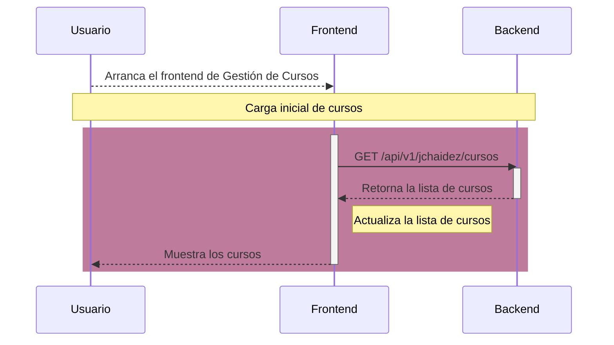
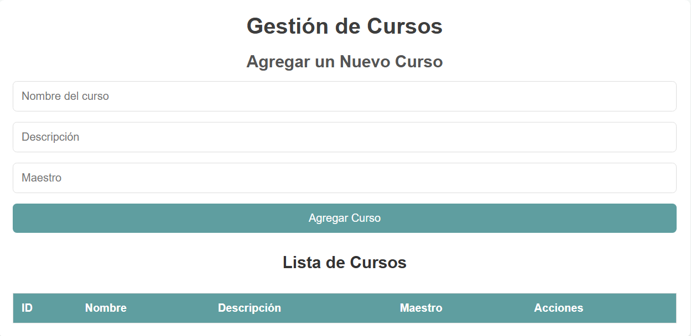
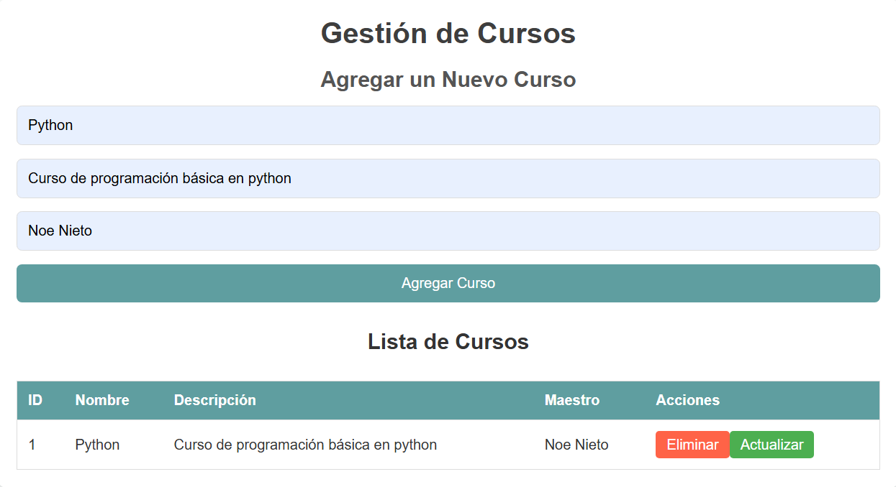
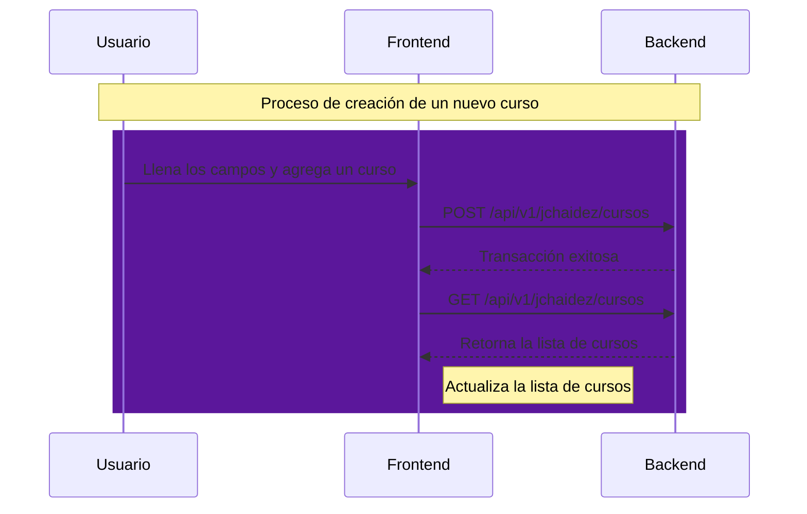
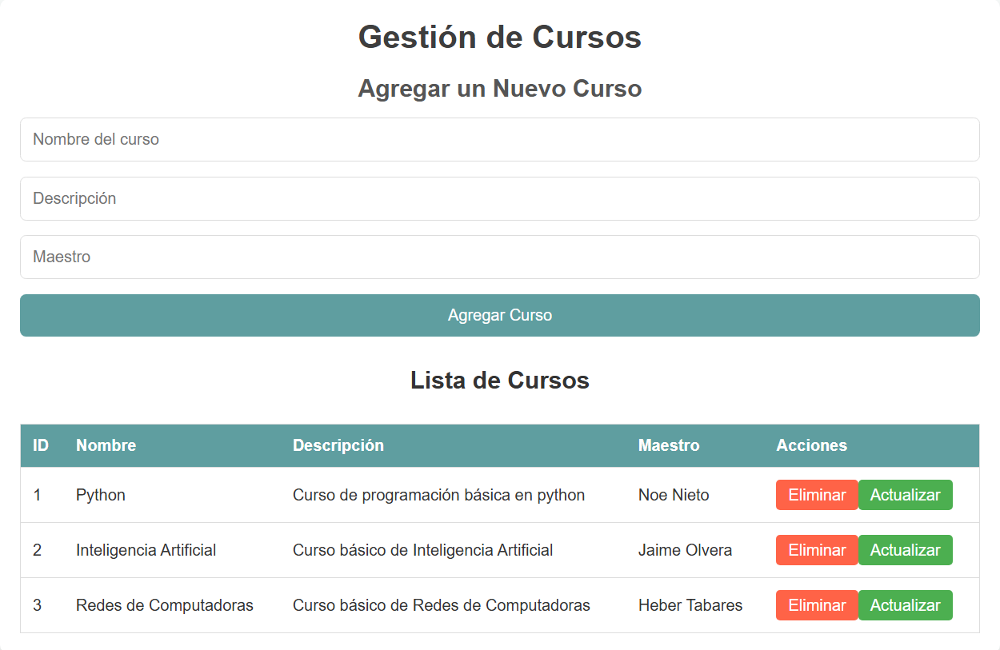
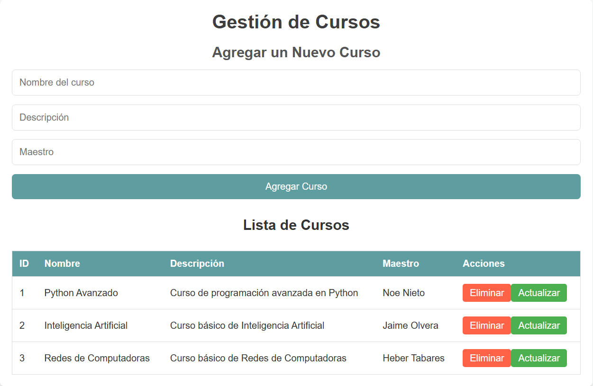
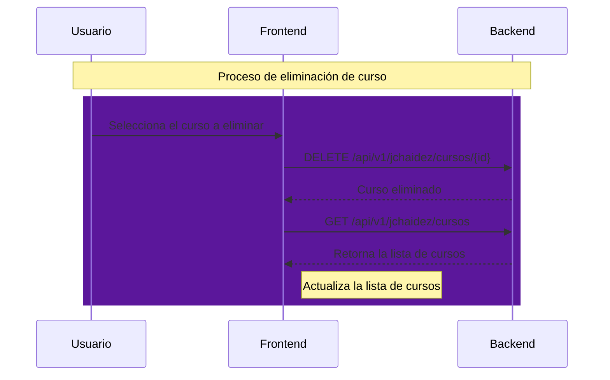
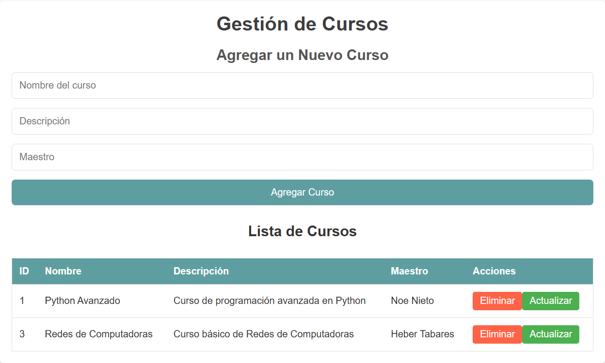

# Proyecto Gestión de Cursos

{ width="30%" align=left }

!!! tip "Descripción General" 
    El proyecto **Gestión de Cursos** es un sistema que permite gestionar cursos, incluyendo la creación, actualización, eliminación y visualización de cursos. El backend está desarrollado en Python utilizando FastAPI, y el frontend está basado en HTML, CSS y JavaScript.

---

## Descripción general del funcionamiento del backend y el frontend

El backend está construido con [FastAPI](https://fastapi.tiangolo.com/). Los archivos de implementación se encuentran en la ruta `/app/proyectos/jchaidez`. Ahí se definen las principales operaciones que permiten gestionar los cursos:

- Creación de un nuevo curso.
- Actualización de un curso existente.
- Eliminación de un curso.
- Visualización de todos los cursos.

El frontend está construido con HTML, CSS y JavaScript, y se conecta al backend mediante la URL `http://localhost:8000/api/v1/jchaidez/cursos`.

### Carga inicial de cursos
Cuando el usuario arranca el frontend, este se conecta al backend para obtener la lista de cursos.

A continuación se muestra un diagrama de secuencia que muestra la comunicación inicial entre el frontend y el backend, justo después de que el usuario accedió al frontend.



### Creación de un nuevo curso
Una vez que el usuario arranca el frontend y los datos iniciales han sido cargados, el usuario puede agregar un nuevo curso mediante el formulario de entrada.



Cuando el usuario llena los campos y presiona el botón *Agregar Curso*, se envía la información al backend y se muestra debajo del formulario el curso agregado.



El formulario tiene validaciones básicas para evitar campos vacíos o incorrectos. El backend guarda la nueva información del curso y responde con una confirmación de éxito. Posteriormente, el frontend vuelve a contactar al backend para obtener la lista actualizada de cursos.



Finalmente, la aplicación de frontend de Gestión de Cursos luce así después de varios registros.





### Actualización de un curso

Si el usuario desea actualizar un curso, puede seleccionar la opción de *actualización* en la interfaz. El frontend solicita la nueva información al usuario, y al enviar la actualización al backend, este la procesa y responde con la confirmación. El frontend luego actualiza la lista de cursos con la nueva información.

```mermaid
sequenceDiagram
    participant Usuario
    participant Frontend
    participant Backend

    Note over Usuario, Backend: Proceso de actualización de curso
    rect rgb(91, 23, 55)
    Frontend-->>Usuario: Solicita nueva información para el curso
    Usuario->>Frontend: Proporciona la nueva información
    Frontend->>Backend: PUT /api/v1/jchaidez/cursos/{id}
    Backend-->>Frontend: Curso actualizado
    Frontend->>Backend: GET /api/v1/jchaidez/cursos
    Backend-->>Frontend: Retorna la lista de cursos
    Note right of Frontend: Actualiza la lista de cursos
    end
```



Finalmente, la aplicación de frontend de Gestión de Cursos luce así después de actualizar un curso.





### Eliminación de un curso
El proceso de eliminación es similar al de la actualización. El usuario selecciona un curso para eliminar, y el frontend solicita la confirmación. Una vez confirmada, el backend elimina el curso y responde con una confirmación. El frontend entonces actualiza la lista de cursos.



Finalmente, la aplicación de frontend de Gestión de Cursos luce así después de eliminar un curso.




---

## Backend - Detalle
El código fuente del backend se encuentra en el módulo `app/proyectos/jchaidez`. Está desarrollado utilizando FastAPI y expone las siguientes rutas:

- **`GET /cursos`**: Obtiene la lista de cursos. [Link a la función](backend.md#app.proyectos.jchaidez.routes.get_cursos)
- **`POST /cursos`**: Crea un nuevo curso. [Link a la función](backend.md#app.proyectos.jchaidez.routes.create_curso)
- **`PUT /cursos/{id}`**: Actualiza un curso existente. [Link a la función](backend.md#app.proyectos.jchaidez.routes.update_curso)
- **`DELETE /cursos/{id}`**: Elimina un curso. [Link a la función](backend.md#app.proyectos.jchaidez.routes.delete_curso)

A continuación se muestran los links a la documentación de cada submódulo.


## Cómo arrancar el backend

Para iniciar el backend, utiliza el siguiente comando:

```bash
uv run uvicorn app.main:app --reload
```

---

## Pruebas del Backend
Las pruebas automatizadas del backend se encuentran en el directorio `/tests/test_jchaidez.py`. Estas pruebas verifican el correcto funcionamiento de las rutas y la lógica de negocio.

[Documentación de funciones de prueba](tests.md){ .md-button .md-button--primary}

### Cómo ejecutar las pruebas
Para ejecutar las pruebas, utiliza el siguiente comando:

```bash
uv run pytest
```

---

## Frontend
El código fuente del frontend se encuentra en el directorio `/frontend/jchaidez`. Este módulo interactúa con el backend para mostrar la lista de cursos y permitir las operaciones de creación, actualización y eliminación.

[Documentación de Funciones del frontend](frontend.md){ .md-button .md-button--primary}

### Cómo arrancar el frontend

Primero arranca el backend, luego ejecutar el siguiente comando para entrar al directorio del frontend:

```bash
cd frontend/jchaidez
```

Una vez estemos en el directorio del frontend, procedemos a ejecutar el siguiente comando:

```bash
python -m http.server 3000 --bind 127.0.0.1
```