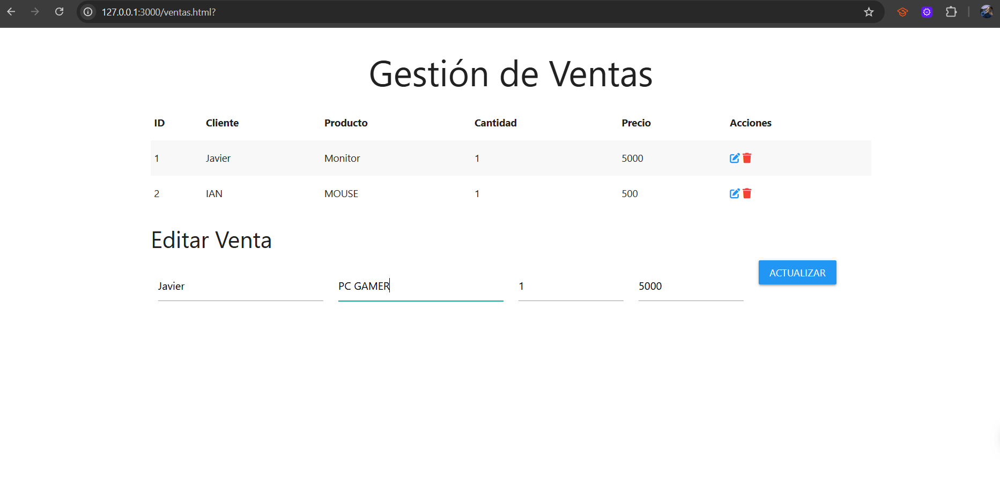

# Proyecto Ventas


!!! tip "Descripción General"
    El proyecto **Ventas** es un ejemplo práctico de cómo crear un API REST utilizando Python y FastAPI. Incluye un backend, un frontend y pruebas automatizadas.

---

## Descripción general del funcionamiento del backend y el frontend

El backend está construido con [FastAPI](https://fastapi.tiangolo.com/). Los archivos de implementación se encuentran en la ruta `/app/proyectos/jcontreras`. Ahi se definen tres operaciones principales:

- Descarga de transacciones

El frontend está construido con la ayuda del Framework [NextJS](https://nextjs.org/) para la construir la interfaz grafica de usuario y se usa la interfaz nativa `fetch` de JavaScript para comunicarse con la base de datos. El frontend se conecta al backend mediante la url `http://127.0.0.1:8000/api/v1/jcontreras/ventas`.

### Carga inicial de datos


Para iniciar el Frontend primero debemos de ir al directorio `./frontend/jcontreras` y ejecutar `npm install && npm run dev` y el frontend se iniciara en `http://localhost:3000`

A continuación se muestra un diagrama de secuencia que muestra la comunicación inicial entre el frontend y el backend, justo después de que el usuario accedió al frontend.


### Creación de ventas

Una vez que el usuario arranco el frontend y los datos iniciales han sido cargados, el usuario puede dar de alta un ventas mediante el boton *Crear ventas*. Cuando el usuario pica el boton se le muestra el siguiente formulario.


El formulario tiene validaciones basicas como que el ISBN debe tener entre 10 y 13 caracteres, el titulo y autor no puede estar vacio ni solo espacios, tambien el boton *Guardar* estara deshabilitado hasta que todo este escrito de manera correcta.


Si el usuario introdujo algun dato que no cumpla con los requerimientos se lanzara un mensaje de error para que se validen los campos


### Creacion de ventas


Finalmente, la aplicacion de frontend de ventas luce asi despues de varios registros.


### Actualizacion de ventas

Para poder actualizar ventas se hace click en el boton de editar y nos despliegara la siguiente ventana




---

## Backend - Detalle

El código fuente del backend se encuentra en el módulo `app/proyectos/jcontreras`. Está desarrollado utilizando FastAPI y expone tres rutas:

- **`GET /ventas`**: Obtiene el estado actual de la libreria. [Link a la funcion](backend.md#app.proyectos.jcontreras.routes.get_ventas)
- **`POST /ventas`**: Permite dar de alta un ventas en la libreria. [Link a la funcion](backend.md#app.proyectos.jcontreras.routes.create_ventas)
- **`PUT /ventas/{ventas_id}`**: Permite actualizar un ventas existente. [Link a la funcion](backend.md#app.proyectos.jcontreras.routes.update_ventas)
- **`DELETE /ventas/{ventas_id}`**: Permite borrar un ventas existente. [Link a la funcion](backend.md#app.proyectos.jcontreras.routes.delete_ventas)

A continuacion se muestran los links a la documentación de cada submódulo.

[Documentación de rutas](autodocs.md#routes){ .md-button .md-button--primary}
[Documentación de modelos](autodocs.md#models){ .md-button .md-button--primary}
[Documentación de esquemas](autodocs.md#schemas){ .md-button .md-button--primary}


### Cómo arrancar el backend

Para iniciar el backend, utiliza el siguiente comando:

```bash
uv run fastapi run
```

---

## Pruebas del Backend

Las pruebas automatizadas del backend se encuentran en el directorio `/tests/jcontreras`. Estas pruebas verifican el correcto funcionamiento de las rutas y la lógica de negocio.

[Documentación de funciones de prueba](tests.md){ .md-button .md-button--primary}

### Cómo ejecutar las pruebas
Para ejecutar las pruebas, utiliza el siguiente comando:

```bash
uv run pytest
```

---

## Frontend

El código fuente del frontend se encuentra en el archivo `/frontend/jcontreras`. Este módulo interactúa con el backend para mostrar el estado de la libreria y permitir operaciones como alta y baja.

[Documentación de Funciones del frontend](frontend.md){ .md-button .md-button--primary}


### Cómo arrancar el frontend

Primero arranca el backend, luego abre otra terminal y utiliza el siguiente comando:

```bash
python -m http.server 3000 --bind 127.0.0.1
```
