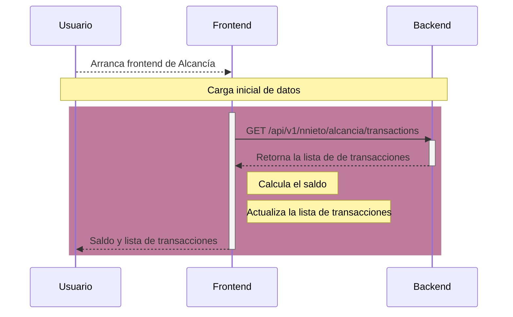
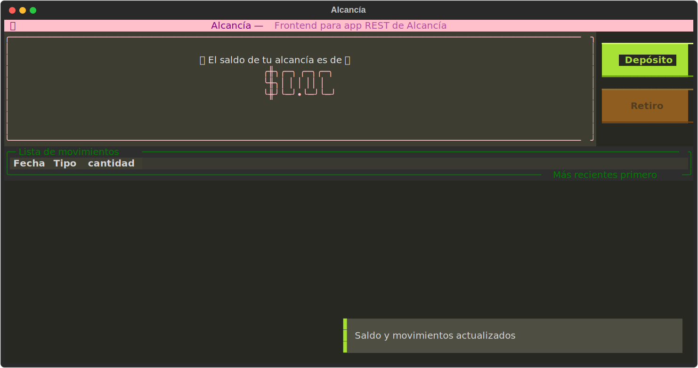
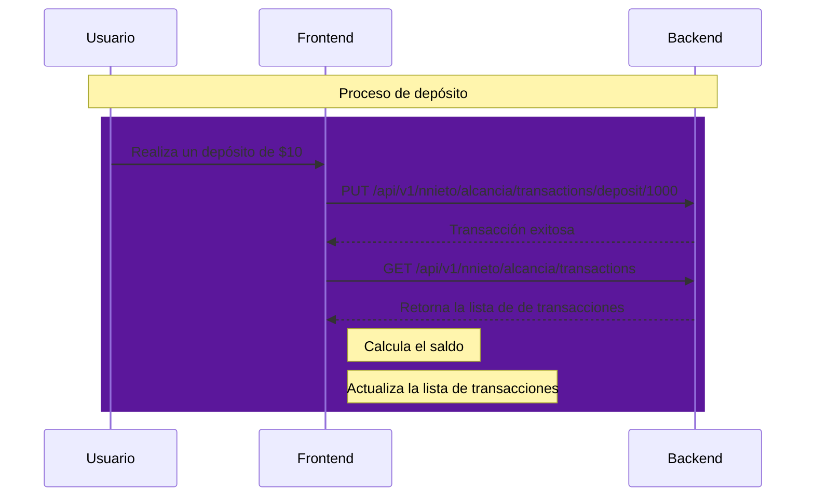

# Proyecto Alcancía

{ width="30%" align=left }

!!! tip "Descripción General"
    El proyecto **Alcancía** es un ejemplo práctico de cómo crear un API REST utilizando Python y FastAPI. Incluye un backend, un frontend y pruebas automatizadas.

---

## Descripción general del funcionamiento del backend y el frontend

El backend está construido con [FastAPI](https://fastapi.tiangolo.com/). Los archivos de implementación se encuentran en la ruta `/app/proyectos/nnieto`. Ahi se definen tres operaciones principales:

- Descarga de transacciones
- Transacción de retiro
- Transacción de depósito

El frontend está constrido con la ayuda de la librería [Textual](https://textual.textualize.io/) para la construir la interfaz grafica de usuario y [httpx](https://www.python-httpx.org/quickstart/) para comunicarse con la base de datos. El frontend se conecta al backend mediante la url `http://127.0.0.1:8000/api/v1/nnieto/alcancia`.

### Carga inicial de datos

Cuando el usuario arranca el programa de frontend, este se conecta al backend para obtener la lista de transacciones.

A continuación se muestra un diagrama de secuencia que muestra la comunicación inicial entre el frontend y el backend, justo después de que el usuario accedió al frontend.



### Creación de depositos

Una vez que el usuario arranco el frontend y los datos iniciales han sido cargados, el usuario puede hacer un deposito en la alcancia mediante el boton *Deposito*. Cuando el usuario pica el boton se le muestra el siguiente formulario.


El formuario tiene validaciones basicas para no permitir depositar cantidades negativas, cero, letras, etc. Ademas del mensaje de error, el boton *Continuar* no se habilitara hasta que el usuario haya escrito una cantidad valida. internamente, el backend guarda las operaciones usando centavos, pero en el frontend la informacion se le presenta al usuario en pesos.

Si el usuario introdujo una cantidad valida y presiona el boton *Continuar*, el frontend hara la operacion de deposito con el backend. Si la transaccion se acepta, volvera a contactar al backend para descargar la lista de movimientos, calcular el saldo y actualizar la interfaz con la nueva informacion. Ver el siguiente diagrama de secuencia.





Finalmente, la aplicacion de frontend de alcancia luce asi despues de varios depositos.


### Creacion de retiros

La ultima operacion es retiro. Tanto el backend como el frontend tienen validacion para no permitir retirar mas dinero del que hay en la alcancia. He aqui el diagrama de secuencia de una operacion de retiro.

```mermaid
sequenceDiagram
    participant Usuario
    participant Frontend
    participant Backend

    Note over Usuario, Backend: Proceso de retiro
    rect rgb(91, 23, 55)
    Frontend-->>Usuario: Notificación (Transacción exitosa)
    Frontend-->>Usuario: Saldo y lista de transacciones
    Usuario->>Frontend: Realiza un retiro de $5
    Frontend->>Backend: PUT /api/v1/nnieto/alcancia/transactions/withdraw/500
    Backend-->>Frontend: Transacción exitosa
    Frontend->>Backend: GET /api/v1/nnieto/alcancia/transactions
    Backend-->>Frontend: Retorna la lista de de transacciones
    Note right of Frontend: Calcula el saldo
    Note right of Frontend: Actualiza la lista de transacciones
    end
```



La inerfaz grafica de retiro es bastante similar a la de deposito. Asi se ve la interfaz grafica despues de hacer un deposito. Nota que en el paso anterior el saldo de la Alcancia era de $ 315.00. Despues del retiro se puede ver que el saldo es de $ 300.00 y el retiro es visible en la lista de movimientos.


---

## Backend - Detalle

El código fuente del backend se encuentra en el módulo `app/proyectos/nnieto`. Está desarrollado utilizando FastAPI y expone tres rutas:

- **`GET /alcancia`**: Obtiene el estado actual de la alcancía. [Link a la funcion](backend.md#app.proyectos.nnieto.routes.transactions_list)
- **`POST /alcancia/depositar`**: Permite depositar una cantidad en la alcancía. [Link a la funcion](backend.md#app.proyectos.nnieto.routes.api_put_transaction)
- **`POST /alcancia/retirar`**: Permite retirar una cantidad de la alcancía. [Link a la funcion](backend.md#app.proyectos.nnieto.routes.api_put_transaction)

A continuacion se muestran los links a la documentación de cada submódulo.

[Documentación de rutas](autodocs.md#routes){ .md-button .md-button--primary}
[Documentación de modelos](autodocs.md#models){ .md-button .md-button--primary}
[Documentación de esquemas](autodocs.md#schemas){ .md-button .md-button--primary}


### Cómo arrancar el backend

Para iniciar el backend, utiliza el siguiente comando:

```bash
uv run fastapi run
```

---

## Pruebas del Backend

Las pruebas automatizadas del backend se encuentran en el directorio `/tests/nnieto`. Estas pruebas verifican el correcto funcionamiento de las rutas y la lógica de negocio.

[Documentación de funciones de prueba](tests.md){ .md-button .md-button--primary}

### Cómo ejecutar las pruebas
Para ejecutar las pruebas, utiliza el siguiente comando:

```bash
uv run pytest
```

---

## Frontend

El código fuente del frontend se encuentra en el archivo `/frontend/alcancia.py`. Este módulo interactúa con el backend para mostrar el estado de la alcancía y permitir operaciones como depósitos y retiros.

[Documentación de Funciones del frontend](frontend.md){ .md-button .md-button--primary}


### Cómo arrancar el frontend

Primero arranca el backend, luego abre otra terminal y utiliza el siguiente comando:

```bash
uv run alcancia
```
