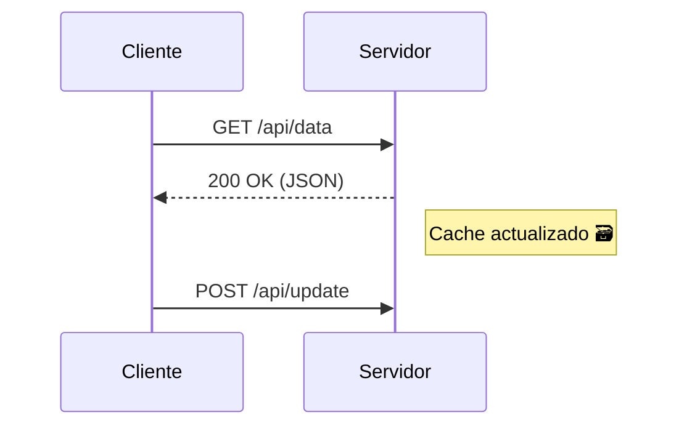

# 🚀 Tutorial de Mkdocs

**MkDocs** es un generador de sitios estáticos diseñado para crear documentación técnica de forma rápida y elegante. Su magia está en convertir archivos Markdown en páginas web navegables, ¡perfecto para manuales, guías o documentación de proyectos como este! ✨

## ¿Para qué sirve?

- Crear sitios web/documentación a partir de archivos Markdown.
- Previsualizar cambios en tiempo real con un servidor local.
- Generar versiones estáticas listas para subir a hosting (GitHub Pages, Netlify, etc.).

## 📝 Tutorial Rápido de Markdown

¡Markdown es súper sencillo! Aquí lo básico:

```markdown
# Título Principal
## Subtítulo
### Sección

- **Negrita**: `**texto**`
- *Itálica*: `*texto*`
- [Enlace](https://ejemplo.com)
- 

1. Lista numerada
2. Segundo item

> Cita inspiradora ✨

`código en línea`

\```python
# Bloque de código
def hola():
    print("¡Hola!")
\```
```

!!! tip
    🔔 Tip: ¡Usa [Markdown Guide](https://www.markdownguide.org/) como referencia!

## 🎨 Funciones extras cortesia de MkDocs-Material

El plugin mkdocs-material añade estilo y funcionalidades profesionales. Algunos highlights:

### 🔗 Enlaces como Botones

¡Convierte enlaces en botones atractivos con clases CSS propias de Material!

#### Botón Básico

```markdown
[¡Haz clic aquí!](https://ejemplo.com){: .md-button }
```

#### Botón Primario (Destacado)

```markdown
[Descargar PDF](/assets/doc.pdf){: .md-button .md-button--primary }
```

#### Botón con Ícono 🚀

```markdown
[Explorar { style="height:1em; vertical-align:text-bottom" }](/ruta){: .md-button .md-button--primary }
```

Ejemplo visual de botones en la [documentacion de MkDocs Material](https://squidfunk.github.io/mkdocs-material/reference/buttons/#usage).

### Pestañas (Tabs) 📑

```markdown
=== "Python"

    \```python
    print("Hola desde Python!")
    ```

=== "JavaScript"

    \```javascript
    console.log("Hola desde JS!");
    \```
```

### Admonitions 📌

```markdown
!!! note "Nota importante"
    ¡Esto resalta información clave! 

!!! danger "Cuidado"
    Algo que requiere atención urgente.
```

### 🌊 Diagramas con Mermaid en MkDocs

¡Es posible crear diagramas profesionales **directamente en Markdown** usando [Mermaid](https://mermaid.js.org/)! MkDocs-Material lo integra de forma nativa. 🎉

**¿Qué puedes hacer con Mermaid?**

- Diagramas de flujo (`flowchart`)
- Diagramas de secuencia (`sequenceDiagram`)
- Gráficos de clases (`classDiagram`)
- Mapas mentales (`mindmap`)
- Personalización de estilos (colores, formas, conectores)
- Y más...

**Ejemplo de Diagrama de Secuencia**:

````markdown

````

El resultado se ve asi:


¡Explora toda la magia en [Mermaid Documentation](https://mermaid.js.org/syntax/sequenceDiagram.html)! 🧙✨

### Integración con mkdocstrings (Documentación automática) 🤖

```markdown
\::: mi_modulo.MiClase
    options:
        show_root_heading: true
```
## Cómo arrancar mkdocs desde la terminal

Para iniciar el servidor local y previsualizar la documentación, utiliza el siguiente comando. El parámetro `-a localhost:8002` especifica que el servidor se levante en el puerto `8002`. Por defecto, el puerto utilizado es el `8000`, pero si ya tienes el backend en ejecución, esto podría generar conflictos.

```powershell
uv run mkdocs serve -a localhost:8002
```

## ¿Dónde debo colocar mi documentación?

- Agrega la documentación de tu proyecto en `/docs/proyectos/<nombre_de_tu_módulo>.md`. Si necesitas usar más de un archivo, como en el caso de la documentación de la alcancía, convierte el archivo en una carpeta y agrega un archivo `index.md` dentro de dicha carpeta.
- Si deseas que tu proyecto aparezca en el menú de navegación, deberás agregarlo en `nav > proyectos` dentro del archivo `mkdocs.yaml`. Si no estás seguro de cómo hacerlo, consulta con el profesor.

## 🔗 Recursos Útiles:

- [Sitio Oficial MkDocs](https://www.mkdocs.org/)
- [Documentación MkDocs-Material](https://squidfunk.github.io/mkdocs-material/)
- [mkdocstrings (Auto-doc)](https://mkdocstrings.github.io/)

¡Ahora a crear documentación que enamore! 🚀